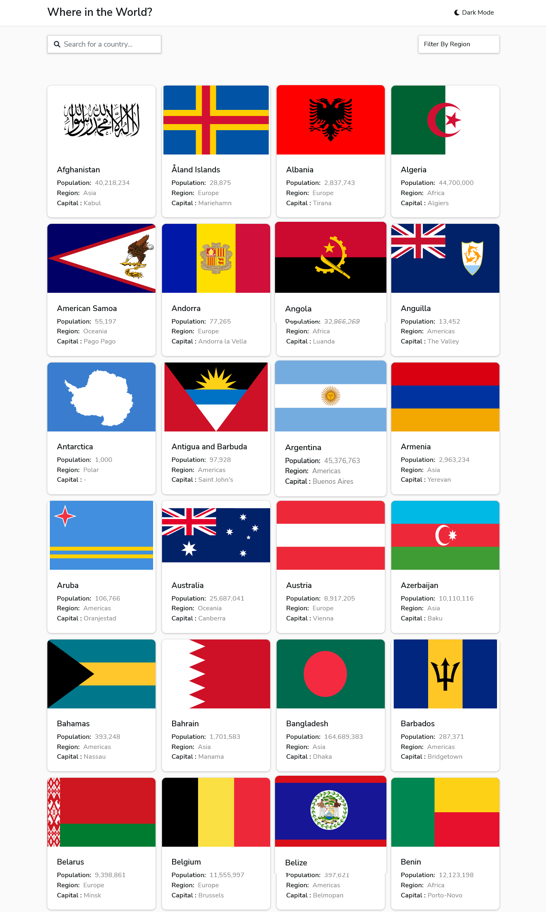
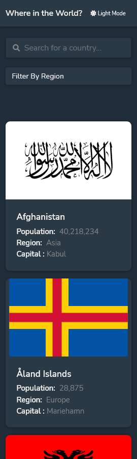

# Frontend Mentor - REST Countries API with color theme switcher solution

This is a solution to the [REST Countries API with color theme switcher challenge on Frontend Mentor](https://www.frontendmentor.io/challenges/rest-countries-api-with-color-theme-switcher-5cacc469fec04111f7b848ca). Frontend Mentor challenges help you improve your coding skills by building realistic projects.

## Table of contents

- [Overview](#overview)
  - [The challenge](#the-challenge)
  - [Screenshot](#screenshot)
  - [Links](#links)
  - [Built with](#built-with)
  - [Author](#author)

## Overview

### The challenge

Users should be able to:

- See all countries from the API on the homepage
- Search for a country using an `input` field
- Filter countries by region
- Click on a country to see more detailed information on a separate page
- Click through to the border countries on the detail page
- Toggle the color scheme between light and dark mode _(optional)_

### Screenshot

### Links

- Solution URL: [Click here](https://www.frontendmentor.io/solutions/reactjs-theme-switcher-bootstrap-scss-B1SrBeuUc)
- Live Site URL: [Click here](https://frontendmentor-countries-reactjs.vercel.app/)

### Built with

- [React](https://reactjs.org/) - JS library
- Flexbox
- CSS Grid
- Mobile-first workflow

### Author

- LinkedIn - [Jonel Hatwell](https://www.linkedin.com/in/jonel-hatwell/)
- Frontend Mentor - [@hatwell-jonel](https://www.frontendmentor.io/profile/hatwell-jonel)
